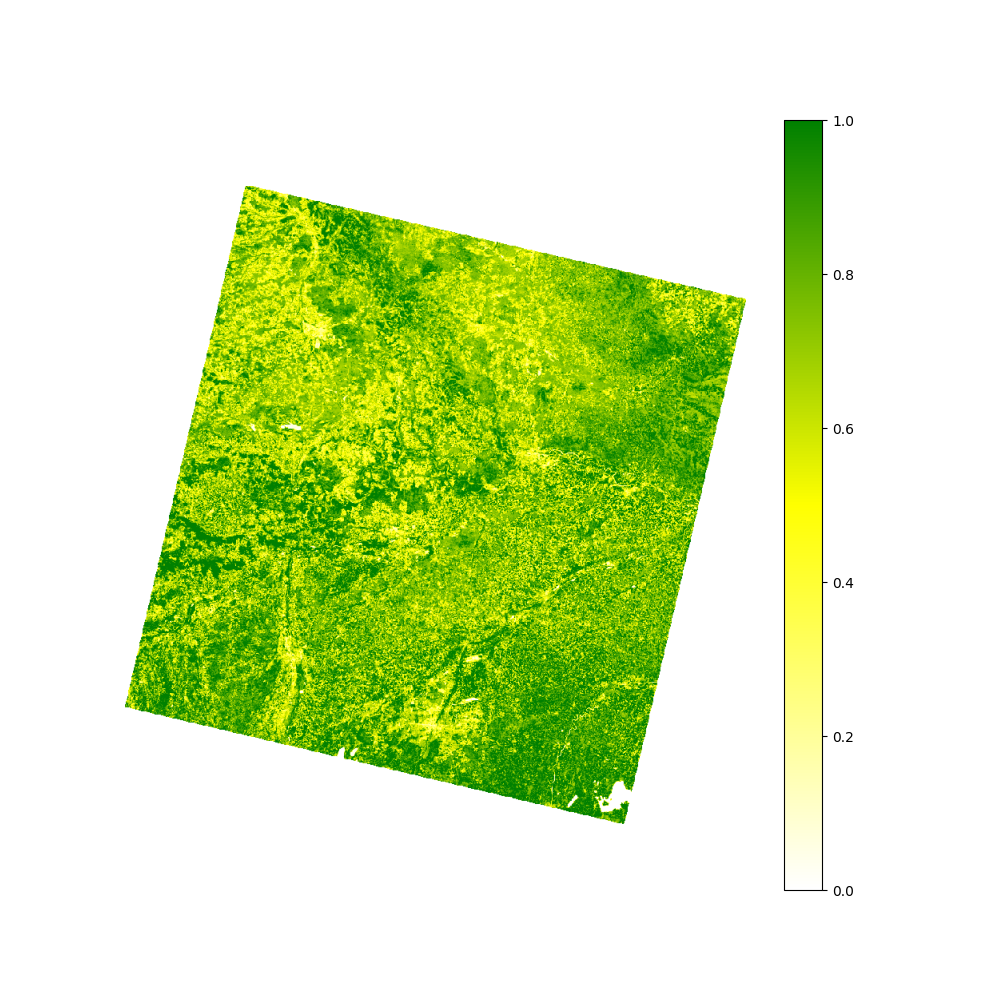

# NDVI #
This directory documents my calculation of the NDVI of central bavaria (near the lower center lies Munich). Via Google Earth Engine I retrieve the proper satellite imagery form [Landsat 8 – Wikipedia](https://en.wikipedia.org/wiki/Landsat_8) as `GeoTIFF` containing all 19 bands and process it further, f.i. by extracting bands individually and merging them to produce new images and indices.

- [extract_bands.py](./extract_bands.py): Isolates band and saves it under [./geotiffs/](./geotiffs/); Usage: `python3 extract_bands.py BAND BAND_NAME`.
- [ndvi.py](./ndvi.py): Calculates the NDVI; currently it produces a bunch of images `GeoTIFF`s and `PNG`s, because I don't know which format works best for upcoming tasks (probably `GeoTIFF` due to additional embedded geo-metadata).

## Produced images
A simple RGB-image:

The corresponding NDVI:

(`matplotlib`'s scaling of the image is lower than the original file. I don't know why and how to fit to it's original dimensions.)
