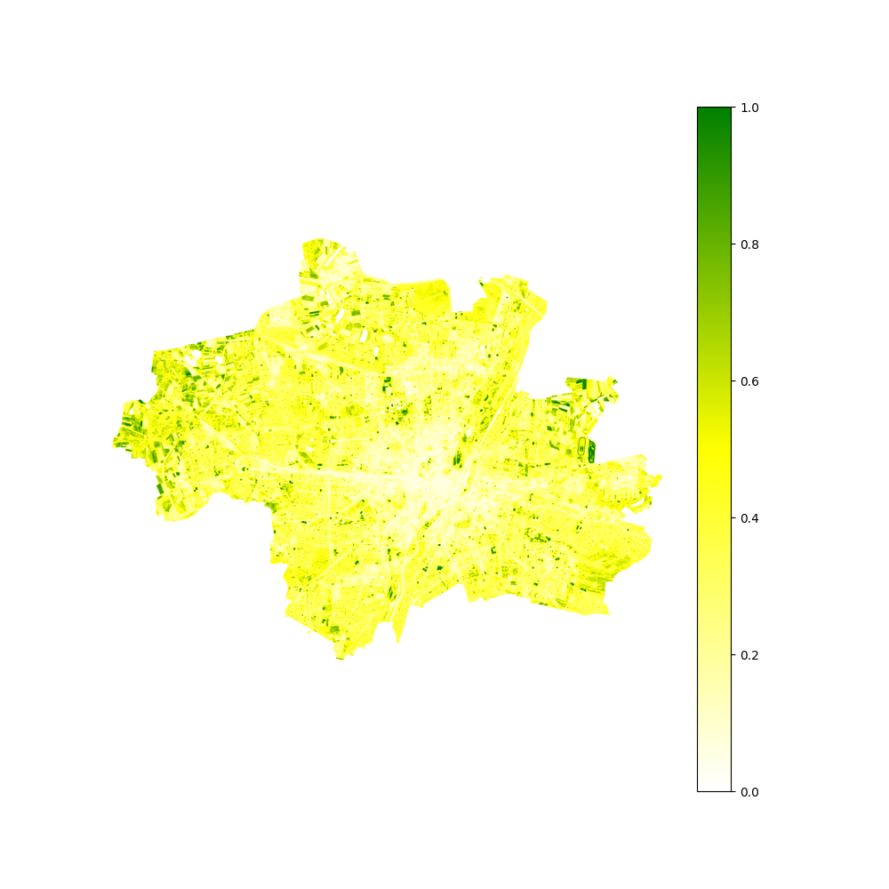

# NDVI #
This directory documents my calculation of the NDVI of Munich. Via [USGS Earth Explorer](https://earthexplorer.usgs.gov/) I retrieve the proper satellite imagery form [Landsat 8 – Wikipedia](https://en.wikipedia.org/wiki/Landsat_8) and crop Munich out. The steps include:
  - Cropping Munich's geopolygon 
  - Preprocessing values for higher quality results (f.i. not whole 16bit color range is exploited)
  - Calculating NDVI
  - Saving image/generating plot
I use `numpy`, `rasterio`, `geopandas`, `shapely` and `matplotlib` to conduct all operations.

Next goal: Evaluate quantitatively the NDVI

~~Next goal: Use a Geopolygon to filter the city of Munich and calculate it's NDVI.~~

- [geojson2shapefile_downsampling.py](./geojson2shapefile_downsampling.py): Converts a GeoJSON file of the city of Munich containing it's districts into a Shapefile resembling the border of Munich (without districts) and applies downsampling because the USGS Earth Explorer only permits <500 vertices.
- [ndvi.py](./ndvi.py): Calculates the NDVI; currently it produces a bunch of images `GeoTIFF`s and `PNG`s, because I don't know which format works best for upcoming tasks (probably `GeoTIFF` due to additional embedded geo-metadata).
- [extract_bands.py](./extract_bands.py): Isolates band from a GeoTIFF containing 1 <= bands <= 19 bands and saves it under [./geotiffs/](./geotiffs/); Usage: `python3 extract_bands.py BAND BAND_NAME`.

## Produced images
The NDVI, data collected was on 2023-03-28, the greener, the more vegetation:

(`matplotlib`'s scaling of the image is lower than the original file. I don't know why and how to fit to it's original dimensions.)

There is also a RGB image of the scene but GitHub doesn't embed the file and I don't know why. Anyway, you can find it in [./geotiffs/](./geotiffs/) (as `rgb.png`).

