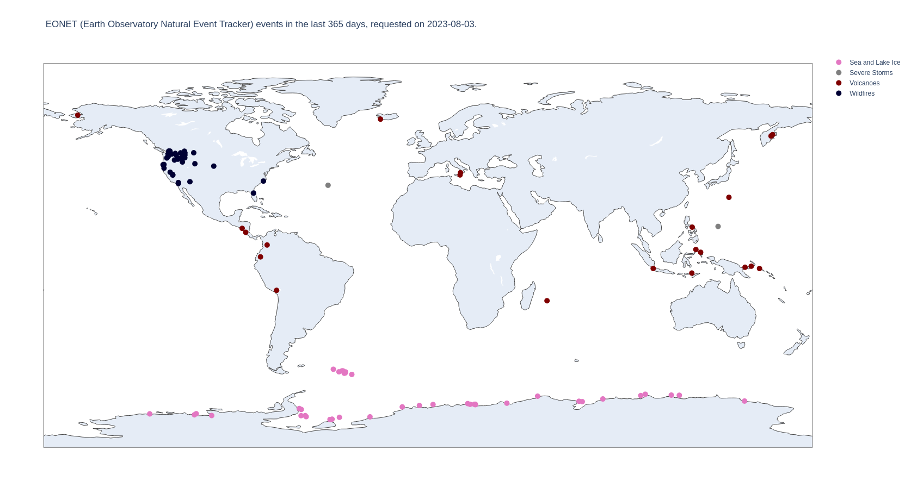

# EONET #
The script [eonet-improved.py](./eonet-improved.py) requests data from the [NASA EONET API](https://eonet.gsfc.nasa.gov/docs/v2.1). An explanation of the EONET project can be found [here](https://eonet.gsfc.nasa.gov/what-is-eonet), in summary: The Earth Observatory Natural Event Tracker (EONET) is a prototype web service with the goal of:

  1. Providing a curated source of continuously updated natural event metadata.
  2. Providing a service that links those natural events to thematically-related web service-enabled image sources (e.g., via WMS, WMTS, etc.).

A plot of the currently (2023-08-03) available data is provided below:

