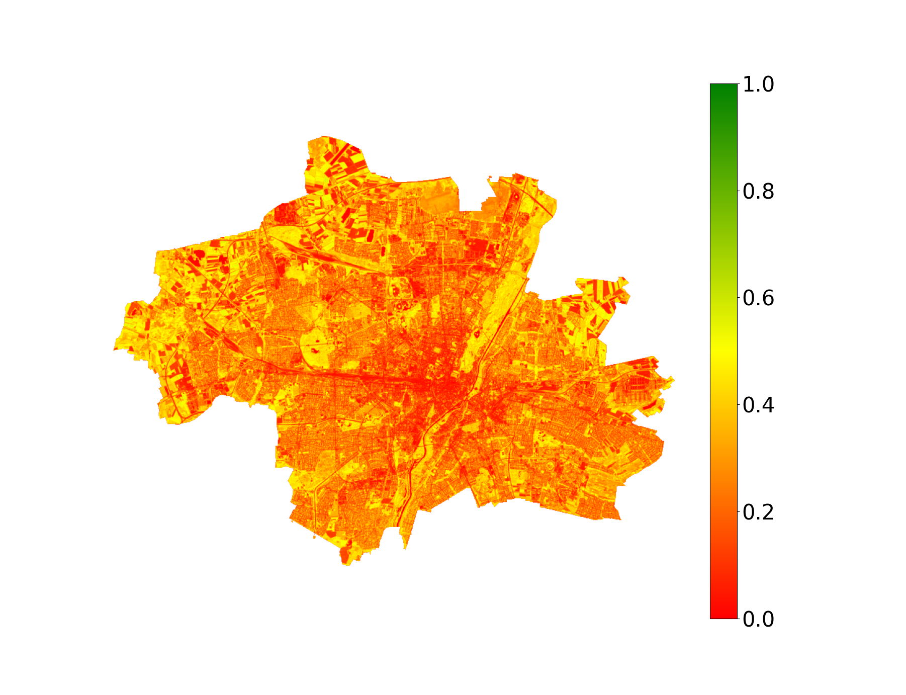

# Earth Observation #
This repository documents my skills in the field of earth observation. In each folder is a separate README explaining the goals.

## Example images
This is just a little showcase of the images I calculated. An explanation is given in the according project's README.

### EONET query ([Go to project](./eonet/))
NASA's EONET API tracks natural events like storms, volcanoes, droughts, floods, etc.

### Satellite imagery of Munich ([Go to project](./satellite_imagery/))
The NDVI is a method to calculate the amount of vegetation using the red and near infrared spectrum captured by a satellite. The higher (greener) the values, the more (healthy) vegetation.

