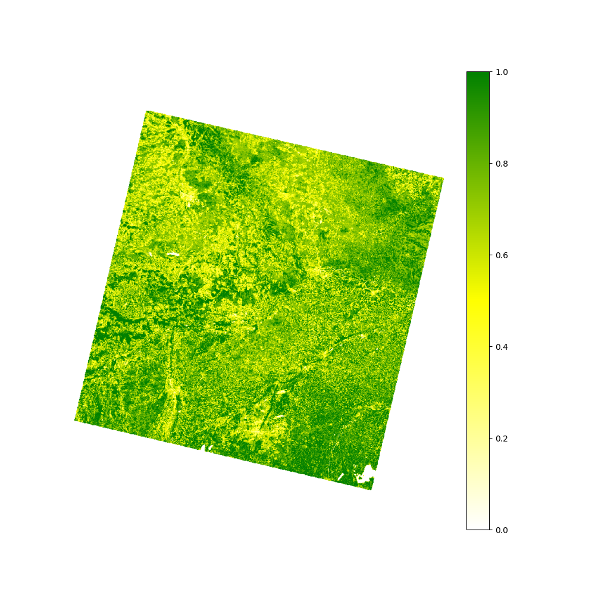

# Earth Observation #
This repository documents my skills in the field of earth observation. In each folder is a separate README explaining the goals.

## Example images
This is just a little showcase of the images I calculated. An explanation is given in the according project's README.

### EONET query ([README](./eonet/README.md))

### NDVI of central Bavaria ([README](./NDVI/README.md))

