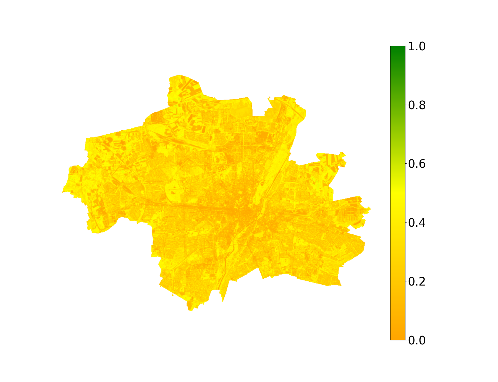
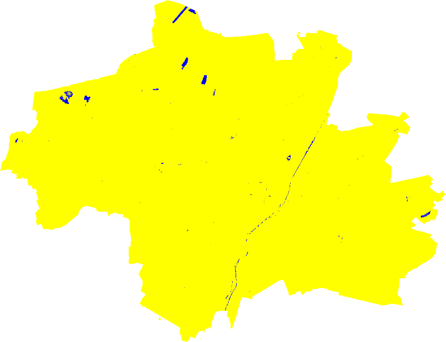

# Satellite Imagery #
This directory documents my calculation of the NDVI of Munich. Via [USGS Earth Explorer](https://earthexplorer.usgs.gov/) I retrieve the proper satellite imagery form [Landsat 8 – Wikipedia](https://en.wikipedia.org/wiki/Landsat_8) and crop Munich out. The steps include:
  - Cropping Munich's geopolygon 
  - Preprocessing data for higher quality results (f.i. not whole 16bit color range is exploited)
  - Calculating an index, f.e. [NDVI – Wikipedia](https://en.wikipedia.org/wiki/Normalized_difference_vegetation_index) or [NDWI – Wikipedia](https://en.wikipedia.org/wiki/Normalized_difference_water_index), evaluating vegetation or water respectively
  - Saving image/generating plot
I use `numpy`, `rasterio`, `geopandas`, `shapely` and `matplotlib` to conduct all operations.

## Roadmap
Exploring more indices (maybe related to water)  
~~Evaluate quantitatively the NDVI~~ (-> [evaluate_NDVI.py](./evaluate_NDVI.py))  
~~Use a Geopolygon to filter the city of Munich and calculate it's NDVI.~~

## Overview
- [apply_colormap.py](./apply_colormap.py): Color map the calculated index to have better visuals (and no gray scale image).
- [adjust_values.py](./adjust_values.py): Satellite data must be clipped to improve quality. Full explanation given in the file directly.
- [evaluate_index](./evaluate_index.py): Evaluate a given index quantitatively by calculating the average and percentage where index > `threshold`; s. "Produces images" for example output.
- [geojson2shapefile_downsampling.py](./geojson2shapefile_downsampling.py): Converts a GeoJSON file of the city of Munich containing it's districts into a Shapefile resembling the border of Munich (without districts) and applies downsampling because the USGS Earth Explorer only permits <500 vertices.
- [isolate_shape.py](./isolate_shape.py): Corps a geometry saved as a shapefile from a GeoTIFF and also it's according mask as boolean array.
- [ndvi.py](./ndvi.py): Calculates the NDVI; currently it produces a bunch of images `GeoTIFF`s and `PNG`s, because I don't know which format works best for upcoming tasks (probably `GeoTIFF` due to additional embedded geo-metadata).
- [ndwi.py](./ndwi.py): Same as [ndvi.py](./ndvi.py) but calculating the NDWI.
- [read_write_functions.py](./read_write_functions.py): Helper functions for reading and writing GeoTIFFs as well as creating plots, f.i. reading certain bands in the correct order.
- [WIP] [make_rgb.py](./make_rgb.py): Combines the red, green and blue bands to an RGB file.

## Produced images
### NDVI
The NDVI, data was collected on 2023-05-15, the greener, the more (healthy) vegetation:

(`matplotlib`'s scaling of the image is lower than the original file. I don't know why and how to zoom/scale it.)  
Output of [evaluate_index.py](./evaluate_index.py) with `threshold = .75`:
```text
The average NDVI of Munich is 0.33...
0.02% of Munich have an NDVI > .75...
    ...when image was taken.
```

### NDWI [WIP]
The [Normalized difference water index – Wikipedia](https://en.wikipedia.org/wiki/Normalized_difference_water_index) is used to monitor changes related to water content in water bodies, using green and NIR wavelengths. Data is from 2023-05-15. Clearly visible is the Isar, some lakes and in the north the olympic regatta area.
  
Disclaimer: The values were multiplied by 10 to increase visibility.
